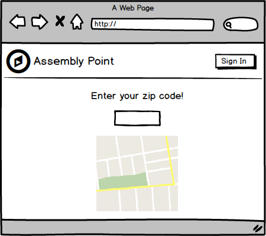
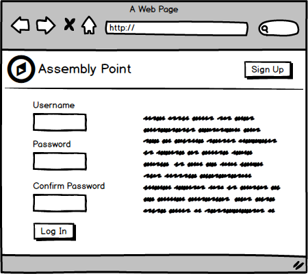
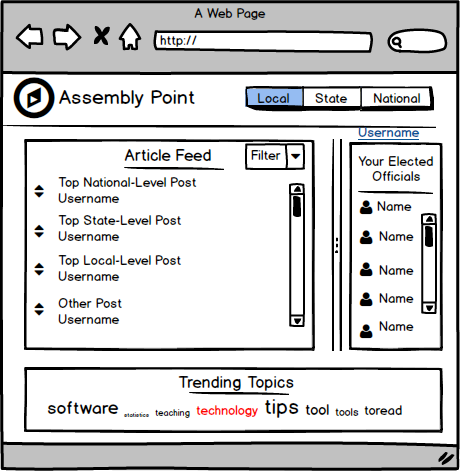
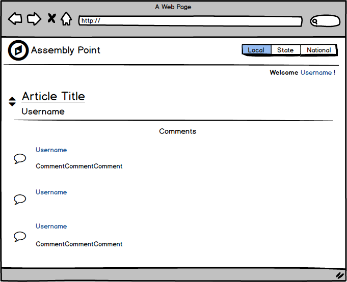

Heroku: https://assembly-point.herokuapp.com/

##About

> Assembly Point is an online application where communities can come together to share information in hopes of increasing awareness > of and participation in local politics and events. The power of community can only be harnessed when all people are informed, and > Assembly Point will serve as a springboard to unleash that energy.

##Process

> This application was constructed over a 2 week process. I was inspired the create an application to serve the needs of people new > to a community, like myself, as well as long-time residents who do not participate in their local politics.

##Future

> In the future, I would like to add more functionality to Assembly Point. I hope to incorporate a voting system for posts and
> comments, as well as incorpoate other databases, such as the Sunlight Congress API, to add more information about officials and
> their political positions.

##Mockups

